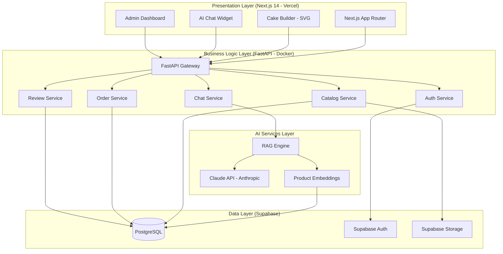
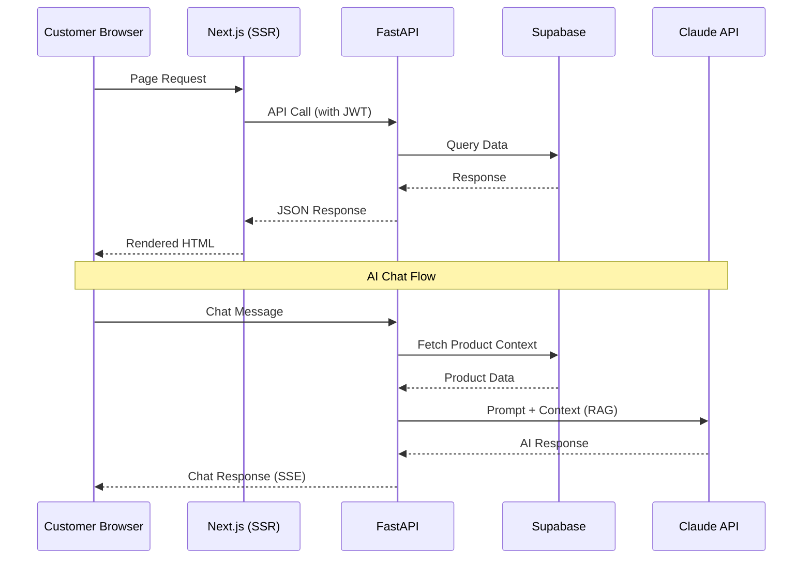
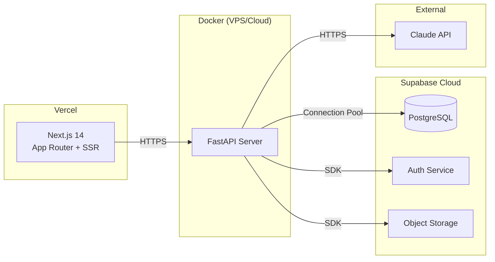
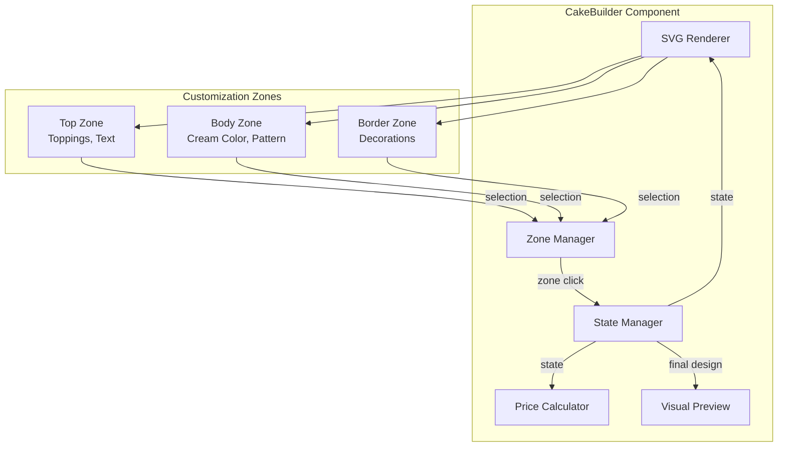
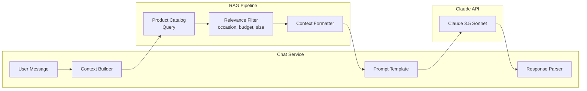
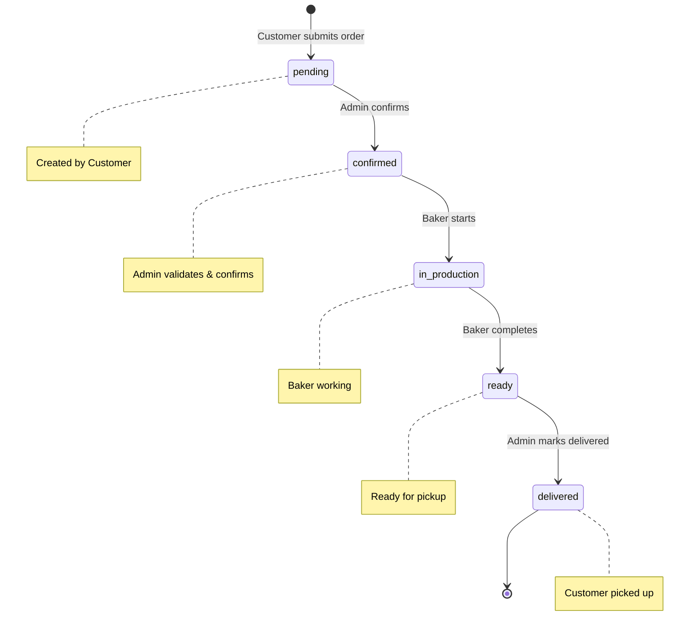
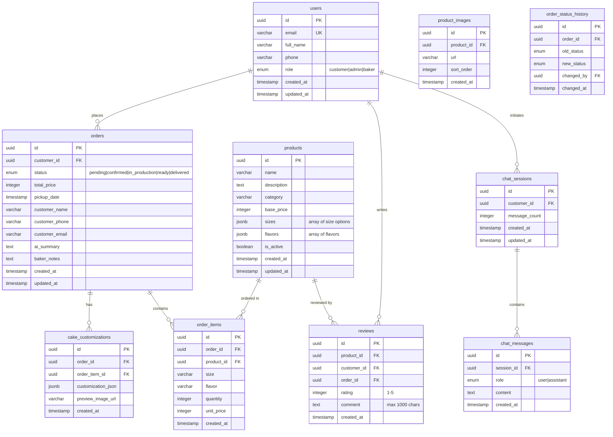

# Design Document: Cake Shop AI Web

## Overview

Hệ thống Web Bán Bánh Kem Tích Hợp AI là ứng dụng thương mại điện tử chuyên biệt cho tiệm bánh kem tại TP.HCM. Kiến trúc ba tầng (Presentation → Business Logic → Data) kết hợp lớp AI Services, triển khai trên Next.js 14 (frontend), FastAPI (backend), Supabase (database + auth + storage), và Claude API (AI chatbot).

**Mục tiêu thiết kế:**
- Trải nghiệm người dùng mượt mà với Cake Builder phản hồi < 100ms
- AI Chatbot tư vấn thông minh dựa trên RAG architecture
- Hệ thống đặt hàng đáng tin cậy với quản lý trạng thái rõ ràng
- Admin Dashboard hiệu quả cho quản lý sản phẩm và đơn hàng
- Mobile-first responsive design với design system nhất quán

## Architecture

### High-Level Architecture



### Request Flow



### Deployment Architecture



## Components and Interfaces

### Frontend Components (Next.js 14)

| Component | Responsibility | Route |
|-----------|---------------|-------|
| `ProductCatalog` | Hiển thị danh mục, filter, pagination | `/products` |
| `ProductDetail` | Chi tiết sản phẩm, reviews, sizes | `/products/[id]` |
| `CakeBuilder` | SVG interactive customization | `/cake-builder` |
| `ChatWidget` | AI chatbot floating widget | Global (all pages) |
| `OrderForm` | Form đặt hàng, pickup schedule | `/checkout` |
| `OrderHistory` | Lịch sử đơn hàng customer | `/orders` |
| `AdminProducts` | CRUD sản phẩm | `/admin/products` |
| `AdminOrders` | Quản lý đơn hàng | `/admin/orders` |
| `BakerDashboard` | View + update orders (Baker) | `/baker/orders` |
| `AuthPages` | Login, Register, OAuth | `/auth/*` |

### Backend API Endpoints (FastAPI)

#### Catalog Service
```
GET    /api/v1/products              - List products (paginated, filtered)
GET    /api/v1/products/{id}         - Product detail
POST   /api/v1/admin/products        - Create product (Admin)
PUT    /api/v1/admin/products/{id}   - Update product (Admin)
PATCH  /api/v1/admin/products/{id}/status - Toggle active status (Admin)
POST   /api/v1/admin/products/{id}/images - Upload image (Admin)
```

#### Order Service
```
POST   /api/v1/orders                - Create order (Customer)
GET    /api/v1/orders                - List customer orders (Customer)
GET    /api/v1/orders/{id}           - Order detail
PATCH  /api/v1/orders/{id}/status    - Update status (Admin/Baker)
GET    /api/v1/admin/orders          - List all orders (Admin)
GET    /api/v1/baker/orders          - List baker orders (Baker)
PATCH  /api/v1/baker/orders/{id}/notes - Update baker notes (Baker)
```

#### Auth Service
```
POST   /api/v1/auth/register         - Register new customer
POST   /api/v1/auth/login            - Login with email/password
POST   /api/v1/auth/oauth/google     - Google OAuth2 callback
POST   /api/v1/auth/refresh          - Refresh JWT token
POST   /api/v1/auth/logout           - Logout
```

#### Chat Service
```
POST   /api/v1/chat/sessions         - Create chat session
POST   /api/v1/chat/sessions/{id}/messages - Send message (SSE response)
GET    /api/v1/chat/sessions/{id}/history  - Get chat history
```

#### Review Service
```
POST   /api/v1/reviews               - Submit review (Customer)
GET    /api/v1/products/{id}/reviews  - Get product reviews (paginated)
```

### Cake Builder Component Architecture



**State Interface:**
```typescript
interface CakeDesign {
  size: '16cm' | '20cm' | '24cm' | '2-tier';
  flavor: string;
  cream_type: string;
  cream_color: string;
  topping_type?: string;
  special_notes?: string; // max 200 chars
  zones: {
    top: ZoneCustomization;
    body: ZoneCustomization;
    border: ZoneCustomization;
  };
}

interface ZoneCustomization {
  color?: string;
  decoration?: string;
  topping?: string;
}

interface PriceBreakdown {
  basePrice: number;      // by size
  toppingCost: number;
  decorationCost: number;
  totalPrice: number;
}
```

### AI Chatbot RAG Architecture



**System Prompt Structure:**
```
Role: Tư vấn viên bánh kem chuyên nghiệp tại tiệm bánh [Shop Name]
Context: {product_catalog_filtered}
Rules:
- Respond in Vietnamese
- Only recommend available products
- Include price from catalog
- Ask clarifying questions if criteria unclear
- Maximum 5 recommendations per response
Conversation History: {last_20_messages}
```

### Order Status State Machine



**Valid Transitions:**
| Current Status | Valid Next Status | Allowed Roles |
|---------------|-------------------|---------------|
| pending | confirmed | Admin |
| confirmed | in_production | Baker |
| in_production | ready | Baker |
| ready | delivered | Admin |

## Data Models

### Database Schema (Supabase PostgreSQL)



### Key Data Constraints

| Table | Constraint | Description |
|-------|-----------|-------------|
| users | email UNIQUE | Không trùng email |
| users | phone CHECK | 10 digits, Vietnamese format |
| products | base_price CHECK | 1,000 - 999,999,999 VND |
| products | name LENGTH | 1-200 characters |
| orders | pickup_date CHECK | >= NOW() + 24h (standard) / 48h (2-tier) |
| orders | status ENUM | pending, confirmed, in_production, ready, delivered |
| reviews | rating CHECK | 1-5 |
| reviews | UNIQUE(product_id, customer_id, order_id) | One review per product per order |
| chat_sessions | message_count CHECK | <= 20 |
| cake_customizations | customization_json JSONB | Required fields: size, flavor, cream_type, cream_color |

### Caching Strategy

| Data | Cache Location | TTL | Invalidation |
|------|---------------|-----|--------------|
| Product catalog | Next.js ISR | 60s | On-demand revalidation on product update |
| Product detail | Next.js ISR | 60s | On-demand revalidation |
| Product images | CDN (Vercel) | 1 day | URL-based versioning |
| Chat context (products) | FastAPI in-memory | 5 min | Product update webhook |
| User session | Browser localStorage | JWT expiry | On logout/expiry |
| Cake Builder state | Browser localStorage | Indefinite | On design completion |

## Correctness Properties

*A property is a characteristic or behavior that should hold true across all valid executions of a system — essentially, a formal statement about what the system should do. Properties serve as the bridge between human-readable specifications and machine-verifiable correctness guarantees.*

### Property 1: Category filter returns only matching products

*For any* product catalog and any selected category, the filtered result SHALL contain only products belonging to that category, and SHALL contain all active products of that category.

**Validates: Requirements 1.2**

### Property 2: Inactive products never appear in customer catalog

*For any* product marked as inactive or out of stock, that product SHALL NOT appear in any customer-facing catalog query regardless of filters, search terms, or pagination state.

**Validates: Requirements 1.5, 6.6**

### Property 3: Price calculation correctness

*For any* combination of cake size (16cm, 20cm, 24cm, 2-tier) and set of customization options (toppings, decorations), the calculated total price SHALL equal the base price for the selected size plus the sum of all selected customization option costs.

**Validates: Requirements 2.4, 2.5**

### Property 4: Cake customization validation completeness

*For any* cake customization data, validation SHALL pass if and only if all mandatory fields (size, flavor, cream_type, cream_color) are present and non-empty. If any mandatory field is missing, validation SHALL fail and the error SHALL identify the missing fields.

**Validates: Requirements 2.6, 2.7**

### Property 5: Cake design localStorage round-trip

*For any* valid CakeDesign state, saving to localStorage and then recovering SHALL produce a CakeDesign object equal to the original.

**Validates: Requirements 2.9**

### Property 6: RAG context contains accurate product pricing

*For any* product catalog state, the RAG context built for the AI chatbot SHALL contain product prices that exactly match the current catalog values for all included products.

**Validates: Requirements 3.3**

### Property 7: AI response parser extracts valid recommendations

*For any* well-formed AI response containing cake recommendations, the parser SHALL extract between 2 and 5 options, each containing a product name, price, and reasoning string.

**Validates: Requirements 3.4**

### Property 8: AI_Summary contains all required fields

*For any* order confirmation through the chatbot, the generated AI_Summary SHALL contain all required fields (size, flavor, decorations, pickup_date, total_price) with non-empty values before the summary is considered complete.

**Validates: Requirements 3.5**

### Property 9: Chat context window bounded at 20 messages

*For any* chat session with N messages, the context sent to Claude API SHALL contain exactly min(N, 20) most recent messages in chronological order.

**Validates: Requirements 3.6**

### Property 10: Order creation validation

*For any* order submission data, the order SHALL be created with status "pending" if and only if all required fields (full_name, phone, pickup_date, at least one product) are present and valid. Missing fields SHALL result in rejection with identification of which fields are missing.

**Validates: Requirements 4.1, 4.7**

### Property 11: Pickup date validation

*For any* pickup date selection and cake type, the date SHALL be accepted if and only if it is at least 24 hours in the future (48 hours for 2-tier cakes) and no more than 30 days in advance. Invalid dates SHALL be rejected with a message indicating the allowed range.

**Validates: Requirements 4.2, 4.3**

### Property 12: Order preserves Cake Builder data

*For any* order created from the Cake Builder, the order record SHALL contain the complete customization_json and AI_Summary exactly as provided, with no field loss or modification.

**Validates: Requirements 4.8**

### Property 13: Registration validation

*For any* registration data, the account SHALL be created if and only if: email is valid (≤254 chars, unique), password meets complexity requirements (8-128 chars, at least one uppercase, one lowercase, one digit), full name is ≤100 chars, and phone is 10-digit Vietnamese format. Invalid fields SHALL result in rejection identifying the failing field.

**Validates: Requirements 5.1, 5.8**

### Property 14: Login rate limiting

*For any* email address, after exactly 5 failed login attempts within a 15-minute window, all subsequent login attempts for that email SHALL be rejected for 15 minutes regardless of credential validity.

**Validates: Requirements 5.4, 5.9**

### Property 15: Role-based access control

*For any* user with role R and any API endpoint E, access SHALL be granted if and only if role R is in the allowed roles for endpoint E. Unauthorized access attempts SHALL be denied.

**Validates: Requirements 5.5**

### Property 16: Order status state machine

*For any* order in status S and any attempted transition to status T, the transition SHALL succeed if and only if (S, T) is a valid transition pair (pending→confirmed, confirmed→in_production, in_production→ready, ready→delivered) AND the requesting user has the required role for that transition. Invalid transitions SHALL be rejected.

**Validates: Requirements 7.2, 7.5, 8.2, 8.3**

### Property 17: Product management validation

*For any* product creation/update data, the operation SHALL succeed if and only if: name is 1-200 chars, description is 1-2000 chars, base_price is 1,000-999,999,999 VND, sizes has 1-10 options, and images has 1-10 files. Invalid data SHALL be rejected with identification of failing fields.

**Validates: Requirements 6.1, 6.2**

### Property 18: Image upload validation

*For any* uploaded image file, the upload SHALL be accepted if and only if the format is JPEG, PNG, or WebP AND the file size is ≤5MB. Accepted images SHALL be resized to maximum 1200×1200 pixels preserving aspect ratio.

**Validates: Requirements 6.4, 6.5**

### Property 19: Order filter correctness

*For any* combination of status filter, date range, and customer name search, the returned orders SHALL include all and only orders matching ALL specified filter criteria simultaneously.

**Validates: Requirements 7.4**

### Property 20: Baker order visibility

*For any* set of orders, the Baker dashboard SHALL display only orders with status "confirmed" or "in_production", sorted by pickup_date ascending.

**Validates: Requirements 8.1**

### Property 21: Baker notes length validation

*For any* baker_notes input, the system SHALL accept notes of 0-500 characters and reject notes exceeding 500 characters.

**Validates: Requirements 8.5**

### Property 22: Review eligibility

*For any* order and current date, a review SHALL be allowed if and only if the order status is "delivered" AND the delivery date is within the last 30 days.

**Validates: Requirements 10.1, 10.4**

### Property 23: Review uniqueness constraint

*For any* (product_id, customer_id, order_id) tuple, the system SHALL accept at most one review. Duplicate submissions SHALL be rejected.

**Validates: Requirements 10.6**

### Property 24: Average rating calculation

*For any* set of review ratings for a product, the displayed average SHALL equal the arithmetic mean of all ratings rounded to 1 decimal place, and the review count SHALL equal the total number of reviews.

**Validates: Requirements 10.3**

## Error Handling

### Frontend Error Handling

| Scenario | Handling Strategy | User Feedback |
|----------|------------------|---------------|
| API timeout (>10s) | Retry once, then show error | Toast: "Kết nối chậm, vui lòng thử lại" |
| Network offline | Detect via navigator.onLine | Banner: "Không có kết nối mạng" |
| 401 Unauthorized | Redirect to login, preserve state | Redirect with return URL |
| 403 Forbidden | Show access denied page | "Bạn không có quyền truy cập" |
| 404 Not Found | Show 404 page | Custom 404 with navigation |
| 422 Validation Error | Highlight invalid fields | Inline field error messages |
| 500 Server Error | Show generic error | "Đã xảy ra lỗi, vui lòng thử lại sau" |
| Image load failure | Show placeholder | Default cake image placeholder |
| localStorage full | Warn user, continue without save | Toast warning |

### Backend Error Handling

| Scenario | HTTP Status | Response Format |
|----------|-------------|-----------------|
| Validation failure | 422 | `{ "detail": [{ "field": "name", "message": "..." }] }` |
| Authentication required | 401 | `{ "detail": "Authentication required" }` |
| Authorization denied | 403 | `{ "detail": "Insufficient permissions" }` |
| Resource not found | 404 | `{ "detail": "Resource not found" }` |
| Rate limit exceeded | 429 | `{ "detail": "Too many attempts", "retry_after": 900 }` |
| Claude API failure | 503 | `{ "detail": "AI service temporarily unavailable" }` |
| Database error | 500 | `{ "detail": "Internal server error" }` (no DB details exposed) |
| File too large | 413 | `{ "detail": "File exceeds 5MB limit" }` |
| Invalid file type | 415 | `{ "detail": "Unsupported format. Use JPEG, PNG, or WebP" }` |

### Error Recovery Strategies

1. **Cake Builder state loss**: Auto-save to localStorage every 5 seconds + on blur/visibility change
2. **Order submission failure**: Preserve form data in session, allow retry
3. **Chat session interruption**: Persist messages to DB, resume on reconnect
4. **JWT expiry during action**: Queue the failed request, refresh token, replay
5. **Image upload failure**: Allow individual retry per image without losing other uploads

### Logging & Monitoring

- **Frontend**: Error boundary components catch React errors, report to console (dev) / error service (prod)
- **Backend**: Structured JSON logging with request_id correlation
- **AI Service**: Log prompt tokens, response time, error rates for cost monitoring
- **Database**: Supabase built-in query performance monitoring

## Testing Strategy

### Testing Pyramid

```
         /  E2E Tests  \          (Cypress/Playwright - 5-10 critical flows)
        / Integration    \        (API tests with test DB - per endpoint)
       / Property Tests    \      (fast-check/Hypothesis - 100+ iterations)
      / Unit Tests           \    (Jest/Pytest - per function)
```

### Unit Tests (Jest + Pytest)

**Frontend (Jest + React Testing Library):**
- Component rendering with various props
- Cake Builder state management logic
- Price calculation functions
- Form validation logic
- Date validation utilities

**Backend (Pytest):**
- Service layer business logic
- Validation functions (registration, order, product)
- Order status transition logic
- Rate limiting logic
- RAG context builder

### Property-Based Tests

**Library Selection:**
- Frontend: [fast-check](https://github.com/dubzzz/fast-check) (TypeScript)
- Backend: [Hypothesis](https://hypothesis.readthedocs.io/) (Python)

**Configuration:**
- Minimum 100 iterations per property test
- Each test tagged with: `Feature: cake-shop-ai-web, Property {N}: {title}`

**Frontend Properties (fast-check):**
- Property 3: Price calculation correctness
- Property 4: Cake customization validation
- Property 5: Cake design localStorage round-trip
- Property 9: Chat context window (message truncation logic)

**Backend Properties (Hypothesis):**
- Property 1: Category filter correctness
- Property 2: Inactive product exclusion
- Property 6: RAG context pricing accuracy
- Property 7: AI response parser
- Property 8: AI_Summary field completeness
- Property 10: Order creation validation
- Property 11: Pickup date validation
- Property 12: Order preserves Cake Builder data
- Property 13: Registration validation
- Property 14: Login rate limiting
- Property 15: Role-based access control
- Property 16: Order status state machine
- Property 17: Product management validation
- Property 18: Image upload validation
- Property 19: Order filter correctness
- Property 20: Baker order visibility
- Property 21: Baker notes validation
- Property 22: Review eligibility
- Property 23: Review uniqueness
- Property 24: Average rating calculation

### Integration Tests

- API endpoint tests with test Supabase instance
- Auth flow (register → login → access protected route)
- Order lifecycle (create → confirm → produce → ready → deliver)
- Image upload pipeline
- Chat session with mocked Claude API

### E2E Tests (Playwright)

Critical user flows:
1. Browse catalog → View product → Add to cart → Checkout
2. Open Cake Builder → Customize → Complete → Order
3. Open chatbot → Get recommendation → Order from chat
4. Admin: Create product → Verify in catalog
5. Baker: View order → Update status → Verify history

### Performance Tests

- Lighthouse CI in CI/CD pipeline (target: score ≥ 80)
- API response time monitoring (target: p95 < 2s)
- Cake Builder interaction latency (target: < 100ms)
- CLS measurement (target: < 0.1)

